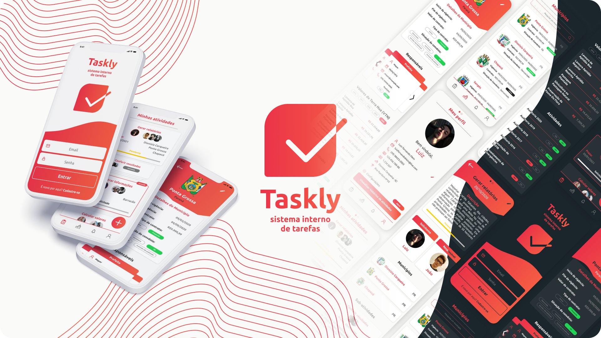

<br />

<p align="center">
  
</p>

<h1 align="center" style="text-align: center;">Taskly</h1>

<p align="center">
	<a href="https://github.com/NightlyTechnologies">
		
	</a>
	<a href="#">
		
	</a>
	<a href="hhttps://github.com/NightlyTechnologies/Taskly/stargazers">
		
	</a>
	<a href="https://github.com/NightlyTechnologies/Taskly/network/members">
		
	</a>
	<a href="https://github.com/NightlyTechnologies/Taskly/graphs/contributors">
		
	</a>
</p>

<p align="center">
	<b>Create tasks for you and your team!</b><br />
	<span>Created with Node.js and React Native, all with Typescript.</span><br />
	<sub>Made with ❤️</sub>
</p>

<br />

<p align="center">
  
  
  
  
  
  
  
</p>

# :pushpin: Contents

- [Features](#rocket-features)
- [Installation](#wrench-installation)
- [Getting started](#bulb-getting-started)
- [Techs](#fire-techs)
- [Issues](#bug-issues)
- [License](#book-license)

# :rocket: Features

- Create activities for you and your teammates
- Update and delete activities
- Create sub-activities for main activities
- Update and delete sub-activities
- See all activities and activities associated with you
- See activity details like responsible, requester, descriptions and sub-activities
- Make progress with your activities
- See all available cities
- See city details
- Update city
- Update profile
- See teammates profiles

# :wrench: Installation

### Required :warning:
- Docker and Docker Compose
- Node.js
- Postgres database
- Yarn

### SSH

SSH URLs provide access to a Git repository via SSH, a secure protocol. If you have an SSH key registered in your GitHub account, clone the project using this command:

```git@github.com:NightlyTechnologies/Taskly.git```

### HTTPS

In case you don't have an SSH key on your GitHub account, you can clone the project using the HTTPS URL, run this command:

```https://github.com/NightlyTechnologies/Taskly.git```

**Both of these commands will generate a folder called Taskly, with all the project**

# :bulb: Getting started

### Server

1. Open the **server** folder and run ```yarn``` to install the dependencies
2. Rename the ```.env.example``` to ```.env``` and set a secret to your app
3. Rename the ```ormconfig.example.json``` to ```ormconfig.json``` and add your postgres **port**, **user** and **password** in the archive
4. Run docker containers using ```docker-compose up -d```
5. Create a postgres database named ```taskly``` 
6. Run ```yarn typeorm migration:run``` to run the migrations to your database
7. If all goes well, the development server will be running on port 3333
8. **Extra:** if you want to see node logs, you can do it through ```docker logs -f taskly_server```
9. **Extra:** if you want to access postgres from cli, run the command ```docker exec -it taskly_postgres psql -d taskly -U user_name -w```


### Mobile

1. Open the **mobile** folder and run ```yarn``` to install the dependencies
2. In ```src/services/api.ts``` change the baseURL for your IPv4 address: ```baseURL: 'http://YOUR-IPV4-ADDRESS:3333'```
3. Download the [Expo Go](https://expo.io/client) app on iOS or Android
4. Run ```yarn start``` to open the expo metro-bundler
5. Scan the QR Code or connect your Expo account on the Expo Go app to open your app

# :fire: Techs

### Typescript (language)

### Node.js (server)
- CORS
- Express
- TypeORM

### React Native (mobile)
- Axios
- Date FNS
- Expo
- React Navigation
- Styled Components

# :bug: Issues

Find a bug or error on the project? Please, feel free to send us the issue on the [Taskly issues area](https://github.com/NightlyTechnologies/Taskly/issues), with a title and a description of your found!

If you know the origin of the error and know how to resolve it, please, send us a pull request, we will love to review it!

# :book: License

Released in 2021.

This project is under the [license](https://github.com/NightlyTechnologies/Taskly/blob/master/LICENSE).

<p align="center">
	< keep coding /> :rocket: :heart:
</p>
